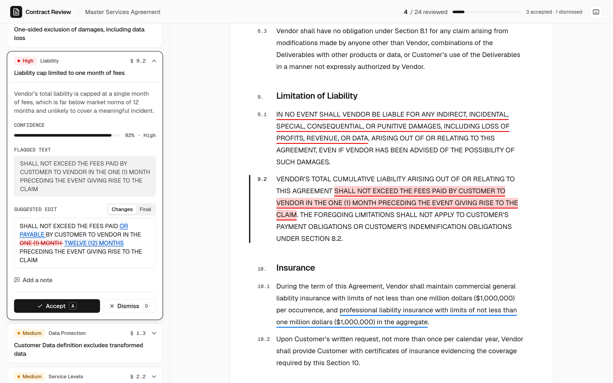

# AI Document Review

A review workspace for AI-generated contract findings. A legal-ops reviewer sees how risky the agreement is, works through each finding next to the clause it refers to, accepts or dismisses it (with an optional note), and knows when they're done.



## Running it

Requires Node 20.19+ or 22.12+.

```bash
npm install
npm run dev        # http://localhost:5173
npm test           # unit tests (Vitest)
npm run build      # type-check + production build
npm run lint       # oxlint
```

The data loads through a small mock service with 600 ms of latency, so the loading state is real. Add `?scenario=` to the URL to see the other paths:

| URL | What you'll see |
|---|---|
| `/?scenario=messy` | Broken agent output: wrong paragraph IDs, reversed or out-of-range offsets, a quote that isn't in the document, duplicate and missing IDs, unknown severity, confidence as a percentage, non-object entries, and more. Each finding's ID or title says what's wrong with it. |
| `/?scenario=empty` | An agent run with no findings |
| `/?scenario=error` | A failed load, with retry |

Each scenario saves its review separately, so it never mixes with the real one.

## What it does

- **Risk at a glance.** A risk level, open High/Medium/Low counts, and a section map coloured by the worst open finding in each section. Clicking a section opens its most severe finding.
- **Findings in context.** Every anchored finding is highlighted in the contract. Clicking a card scrolls the document to its text, and clicking highlighted text opens its card. While a finding is selected, the other highlights fade to an underline so the selected text stands out.
- **Decisions.** Accept, dismiss, undo, and add a note to any finding. After a decision the next pending finding opens automatically, and a toast offers a quick undo. Decisions are saved to `localStorage` per document.
- **Progress and completion.** "12 / 24 reviewed" in the header, and a "Review complete" state with the final counts when nothing is pending.
- **Focus.** Filter by status, severity and category; each option shows how many results it would give. Sort by severity or document order. The document highlights follow the filters.
- **Suggested edits as a word diff** against the flagged text, with a Changes / Final toggle.
- **Keyboard.** `J`/`K` next and previous, `A` accept, `D` dismiss, `U` undo, `Esc` close, `?` lists the shortcuts.
- **Narrow screens.** A Findings / Document switcher replaces the side-by-side layout.

## How it's put together

```
src/
  data/        loadReviewData (mock service + scenarios), normalize (untrusted JSON → typed data)
  utils/       annotations (anchor resolution, flat segments), filters, summary, diff   ← pure, unit-tested
  hooks/       useReviewState, useFindingSelection, useKeyboardShortcuts
  components/  ReviewWorkspace (composition root) + presentational components
  types/       review.ts
```

Data flows one way: **raw JSON → `normalize` → `buildDocumentAnnotations` → components**.

- `App` only handles loading and errors. Once data is loaded it renders `ReviewWorkspace`, which owns the state and composes the panels. The review-state hook is keyed by document ID, so it can only exist after loading.
- All the logic linking findings to text, and all the counting and filtering, is pure functions in `utils/`. The components render and handle events, which keeps them small and keeps the logic testable without a DOM.
- No state library. There are three pieces of state with clear owners:
  - **Review state:** `{ [findingId]: { status, comment? } }` in `useReviewState`, saved to `localStorage`. Findings without an entry are pending. Stored data is checked on load, so a corrupt or hand-edited value can't crash the app.
  - **Selection:** in `useFindingSelection`. It remembers whether the click came from the list, the document, or a programmatic jump, so only the *other* pane scrolls. After a jump it moves keyboard focus to the new card, because the button you pressed may have just unmounted.
  - **Filters:** plain `useState` in the workspace. They're a temporary view, so they aren't saved.
- Everything else (summary counts, the visible list, the section map) is derived with `useMemo`, so nothing can drift out of sync.

## How annotation matching works

Each anchor is resolved once, at load time (`utils/annotations.ts`):

1. **Exact:** the paragraph exists, the offsets are valid, and the text at those offsets matches the quote (ignoring whitespace differences). It's highlighted as given.
2. **Relocated:** otherwise, search for the quote, starting in the intended paragraph and then the rest of the document. If it appears more than once, the occurrence nearest the given offset wins. The highlight goes there, and the details panel says it was moved.
3. **Unresolved:** if the quote can't be found, nothing is highlighted, so there's no broken highlight. The finding is listed in a banner above the document under "Text not found", and the reviewer is told to check the clause manually.
4. **Document-level** (`anchor: null`): listed in the same banner under "Whole document".

**Cross-paragraph spans** (`endParagraphId`) become one range per paragraph. They're only treated as exact if the joined text matches the quote. Both parts highlight and select the same finding.

**Overlaps:** each paragraph is cut at every range start and end into flat pieces, and each piece records which findings cover it. So the markup is always a flat list of `<mark>`s, never nested. Overlapping pieces get a double underline and a stronger tint, and clicking one cycles through its findings, most severe first. Fading the other highlights while one finding is selected makes clear which finding you're looking at.

In the supplied data this produces 22 exact anchors, 1 relocated (**f-20**: its offsets point at "ng acts of God…", but its quote is 43 characters later), 1 document-level (f-09), one cross-paragraph span (f-02), and one overlap (f-04/f-05 in §6.2).

## Handling messy data

`data/normalize.ts` treats both JSON files as untrusted and cleans them in one place, so components can rely on their types:

- **Contract:** paragraphs with no ID, no text or a repeated ID are dropped. If nothing readable is left, loading fails with a clear error and a retry button.
- **Findings:**
  - Non-object entries are skipped, missing IDs are generated, and repeated IDs get a suffix.
  - Severity ignores case. **Unknown severity becomes medium**, which neither hides a possible risk as low nor inflates it to high.
  - A missing category, title or explanation gets a sensible default; a missing title is built from the start of the explanation.
  - Confidence given as 0–100 is converted to 0–1, and unusable values show as "Not provided".
  - Offsets given as text are converted to numbers, and an empty `suggestedEdit` becomes `null`.
- **Anchors:** a missing `anchor` is treated like `null` (whole document). A *malformed* anchor, such as a plain string, is kept, so it shows as "Text not found" instead of silently disappearing.
- **Empty and failed states:**
  - No findings at all: a "no findings" message.
  - Filters that match nothing: a message with "Clear filters".
  - A selected finding that the filters now exclude stays visible with a note, so accepting something under a "Pending" filter doesn't snap its details away.
  - Failed load: a retry button.

## Key decisions and alternatives

- **Findings expand inside their cards.** I considered a separate, fixed details panel (three columns). It would squeeze the document, and expanding in place keeps the finding's details next to its place in the list.
- **Auto-advance after each decision.** The brief asks for something "fast to work through", so after accepting or dismissing, the next pending finding opens, following the current filters and sort. The toast's undo makes this safe.
- **Default sort is severity, not document order.** Severity puts the riskiest work first, and the agent's own output is ordered that way. Document order is one click away.
- **A note is not a decision.** "Reviewed" means accepted or dismissed. A finding with only a note is still pending, so progress reflects real decisions.
- **Accepted findings still count toward risk; dismissed ones don't.** Accepting confirms the problem exists until the contract is renegotiated. Dismissing says it isn't a problem.
- **The suggested-edit diff is hand-written** (a word-level longest-common-subsequence, about 90 lines). The texts are short, so the simple algorithm is instant. When less than half the original wording survives, the edit opens on "Final", because a word-by-word diff of a full rewrite is mostly noise.
- **A section map instead of a scroll-aligned strip.** It answers "where are the problems?" without measuring the page layout, and every cell is a labelled button.
- **No UI or annotation library.** Everything is React, TypeScript and plain CSS, plus `lucide-react` for icons. The look is a Geist-style ink-on-white system, with the colors and spacing defined once as CSS variables.

## Accessibility

- **Keyboard:**
  - Highlights are focusable and work with Enter or Space. Cards use real buttons that report whether they're expanded.
  - Focus moves sensibly after each action, and there's a skip link to the document.
  - Single-key shortcuts pause while typing.
  - The shortcuts list uses the native `<dialog>`, which provides focus trapping and Esc to close.
- **Screen readers:**
  - One `<main>`, a correct heading order, and labelled controls.
  - The selected card is marked as current, and the progress bar and confidence meter are labelled.
  - Decisions are announced through the toast.
  - The diff's added and removed text carries hidden "added:"/"removed:" labels, since most screen readers don't announce `<ins>`/`<del>`.
- **Color:**
  - Severity always has a text label, never color alone.
  - All text meets WCAG AA.
  - The medium amber was deepened from `#f5a623` to `#d98200` so it stays distinguishable from red for color-blind users. I checked this with a palette validator.
- **Motion:** smooth scrolling and animations are off under `prefers-reduced-motion`.
- **Checked with axe-core** in 8+ states (desktop, narrow, error, empty, messy, filters, dialog open, review complete), with no violations.

## Testing

- **Unit tests:** `npm test` runs 40 Vitest tests over the pure logic.
  - Anchor resolution against the real data, plus broken anchors.
  - Splitting overlaps into flat pieces, and checking the pieces always rejoin to the original text.
  - Filters, sorting and next-pending.
  - Normalizing the messy sample, and the word diff.
- **Browser checks:** I ran the UI flows by hand in a browser driven by Playwright. Those scripts aren't committed. The next step would be to add Playwright or Testing Library tests to the repo.

## What I prioritized, what I cut, and what's next

**Prioritized:** the link between findings and text in both directions, handling imperfect anchors correctly, and a review loop that's fast with mouse or keyboard. Robustness and accessibility were treated as features, not cleanup.

**Cut:**
- **Applying suggested edits to the document.** Rewriting the text would shift the offsets every other highlight depends on, and f-04 and f-05 overlap. Doing it properly needs a model of tracked changes that re-anchors the other findings.
- **Review export or summary, dark mode, and a real LLM for follow-up questions.**

**With more time:**
- **Apply edits** as tracked changes over the original text (showing a redline), with highlights re-anchored after each change.
- **Export** the completed review as Markdown or JSON (decisions, notes, accepted edits) to hand to counsel.
- **Long documents:** memoize paragraph rendering (`React.memo` plus stable callbacks), and use list virtualization or `content-visibility: auto` once documents reach hundreds of pages. Today every paragraph re-renders on each change, which is fine at 42 paragraphs.
- **Better quote matching:** fuzzy matching (for example ignoring punctuation and curly quotes) for quotes that are close but not exact, and quotes that span paragraphs without `endParagraphId`.
- **Committed component and end-to-end tests,** a hosted demo, and shared review state on a backend so a team can review together.
